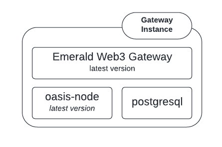
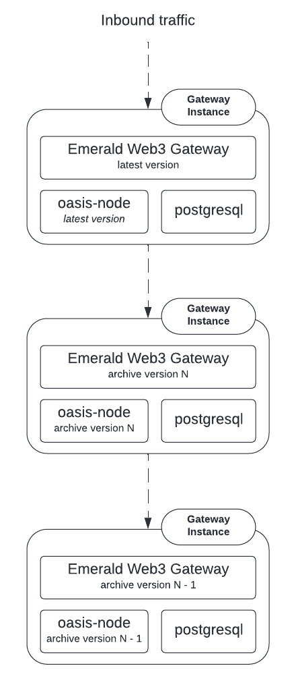

# Deploying the Emerald Web3 Gateway

## Deployment Architecture

To deploy an emerald web3 gateway, a single instance (e.g. VM, Bare Metal,
Kubernetes Pod, etc.) of the deployment looks like this:



_Note: the latest version of the web3 gateway server has an untested
configuration that allows for a shared postgres database. This guide, at this
time, does not go over using that configuration._

As is shown in the above diagram, an emerald web3 gateway currently requires a
colocated oasis-node and (at this time) a colocated postgres server. Not shown
in the diagram is any load balancing infrastructure, that part of the
architecture is left up to the reader.

### Archive architecture

In order to support archive emerald web3 requests, the following architecture is
required:



For archive support, multiple versions of an emerald web3 gateway deployment are
required and are linked together in a chain. The top of the chain is intended to
be the most current web3 gateway node representing the present state of the
network. The bottom of the chain would be the oldest archive node. At this time
there are only the cobalt and damask nodes that can be run in this way, so 2
layers of web3 gateway nodes are required. In the future, multiple layers of
web3 gateways may exist.

## Deploying the Damask (oasis-node v22) Emerald Web3 gateway

At the time of writing the Damask, `oasis-node v22.x.y`, is the current version
of the network.

### Required Software

* oasis-node v22
  * This should be the current version deployed on the network.
* emerald-paratime v8
  * This should be the current version deployed on the network
* emerald-web3-gateway
  * At this time you will need to build this yourself from the `main` branch of
    [oasisprotocol/emerald-web3-gateway](https://github.com/oasisprotocol/emerald-web3-gateway).
* postgres 14.x
  * Older versions of postgresql might be possible to use but are untested. This
    guide does not provide instructions for deploying postgres.

### Configuring your Damask Emerald Client oasis-node

It is required (and assumed) that your `oasis-node` binary and
`emerald-paratime.orc` package are installed on the same VM or physical machine.
For the following example, both files are in `/var/oasis`. Additionally, the
datadir for the node is assumed to be `/serverdir/node` which includes the
genesis document at the root of that directory. The genesis document should be
for the damask deployment
[here](https://github.com/oasisprotocol/mainnet-artifacts/releases/download/2022-04-11/genesis.json).

Given the previous system conditions, we will place the configuration in
`/serverdir/node/config.yml`. Minimally, this will look like:

```yaml
datadir: /serverdir/node

# Logging.
# Per-module log levels are defined below. If you prefer just one unified log level, you can use:
# log:
#   level: debug
log:
  level:
    # Per-module log levels. Longest prefix match will be taken. Fallback to "default", if no match.
    default: info
    tendermint: warn
    tendermint/context: error
  format: JSON

# Genesis.
genesis:
  file: /serverdir/node/genesis.json

worker:
  storage:
    checkpoint_sync:
      disabled: true

# Consensus backend.
consensus:
  # Tendermint backend configuration.
    mode: full

    p2p:
      # List of seed nodes to connect to.
      # NOTE: You can add additional seed nodes to this list if you want.
      seed:
        - "{{ seed_node_address }}"

runtime:
  mode: "client"
  paths:
    - /var/oasis/emerald-paratime.orc

  config:
    "000000000000000000000000000000000000000000000000e2eaa99fc008f87f": {"allow_expensive_queries": true}
```

### Configuring the Damask Emerald Web3 Gateway

_Note: This configuration assumes postgres will be deployed for each instance of
the gateway._

This configuration for the emerald web3 gateway assumes that the `oasis-node`
process is configured as it is in the previous section.

In the file `/serverdir/gateway/config.yml`:

```yaml
runtime_id: "000000000000000000000000000000000000000000000000e2eaa99fc008f87f"
# This needs to be the damask emerald client node
node_address: "unix:/serverdir/node/internal.sock"
# This will need to point to the archive web3 gateway deployed in the next section
archive_uri: "https://some_url_to_the_cobalt_archive.example.com"

enable_pruning: false

log:
  level: warn
  format: json

database:
  host: "postgres"
  port: 5432
  db: "web3"
  user: "web3"
  password: "somepassword"
  dial_timeout: 5
  read_timeout: 10
  write_timeout: 5
  max_open_conns: 0

gateway:
  chain_id: 42262
  http:
    host: "0.0.0.0"
    port: 8545
    cors: ["*"]
  ws:
    host: "0.0.0.0"
    port: 8546
    cors: ["*"]
  method_limits:
    get_logs_max_rounds: 100
```

### Starting your server processes

Once you've configured using the templates above, you can then start your
`oasis-node` and `emerald-web3-gateway` processes. Ideally, you'd use some kind
of process manager to do this. To run these processes in the foreground, you
will run the following commands.

For `oasis-node`:

```bash
oasis-node --config /serverdir/node/config.yml
```

For `emerald-web3-gateway`:

```base
emerald-web3-gateway --config /serverdir/gateway/config.yml
```

If all configuration worked correctly, the `emerald-web3-gateway` process will
begin to index blocks and the health endpoint of the service located at
`http://127.0.0.1:8545/health` will eventually return 200.

## Deploying the Cobalt (oasis-node v21) Emerald Web3 gateway

If you do not wish to deploy an archive node this entire section can be skipped.

### Required Software

* [oasis-node v21.3.14](https://github.com/oasisprotocol/oasis-core/releases/tag/v21.3.14)
* [emerald-paratime v7.1.0](https://github.com/oasisprotocol/emerald-paratime/releases/tag/v7.1.0)
* [emerald-web3-gateway v1.7.0](https://github.com/oasisprotocol/emerald-web3-gateway/releases/tag/v1.7.0)
* postgres 14.x
  * Older versions of postgresql might be possible to use but are untested. This
    guide does not provide instructions for deploying postgres.

### Configuring your Cobalt Emerald Client oasis-node

It is required (and assumed) that your `oasis-node` and `emerald-paratime`
binaries are installed on the same VM or physical machine. For sake of example,
both files are in `/var/oasis`. Additionally, the datadir for the node is
assumed to be `/serverdir/node` which includes the genesis document at the root
of that directory. The genesis document should be for the cobalt deployment
[here](https://github.com/oasisprotocol/mainnet-artifacts/releases/download/2021-04-28/genesis.json).

```yaml
datadir: /serverdir/node

# Logging.
# Per-module log levels are defined below. If you prefer just one unified log level, you can use:
# log:
#   level: debug
log:
  level:
    # Per-module log levels. Longest prefix match will be taken. Fallback to "default", if no match.
    default: info
    tendermint: warn
    tendermint/context: error
  format: JSON

# Genesis.
# MAKE SURE THIS IS THE COBALT GENESIS FOUND HERE:
# https://github.com/oasisprotocol/mainnet-artifacts/releases/download/2021-04-28/genesis.json
genesis:
  file: /serverdir/node/genesis.json

# Worker configuration.
worker:
  storage:
    enabled: True

    checkpoint_sync:
      disabled: true

consensus:
    mode: archive

runtime:
  supported:
    - "000000000000000000000000000000000000000000000000e2eaa99fc008f87f"

  history:
    tag_indexer:
      backend: bleve

  paths:
    "000000000000000000000000000000000000000000000000e2eaa99fc008f87f": /var/oasis/emerald-paratime

  config:
    "000000000000000000000000000000000000000000000000e2eaa99fc008f87f": {"allow_expensive_queries": true}
```

### Configuring the Cobalt Emerald Web3 Gateway

_Note: This configuration assumes postgres will be deployed for each instance of
the gateway._

```yaml
runtime_id: "000000000000000000000000000000000000000000000000e2eaa99fc008f87f"
# This needs to be the cobalt emerald client node
node_address: "unix:/serverdir/node/internal.sock"

enable_pruning: false

log:
  level: warn
  format: json

database:
  host: "postgres"
  port: 5432
  db: "web3"
  user: "web3"
  password: "somepassword"
  dial_timeout: 5
  read_timeout: 10
  write_timeout: 5
  max_open_conns: 0

gateway:
  chain_id: 42262
  http:
    host: "0.0.0.0"
    port: 8545
    cors: ["*"]
  ws:
    host: "0.0.0.0"
    port: 8546
    cors: ["*"]
  method_limits:
    get_logs_max_rounds: 100
```

### Starting your archive server processes

Once you've configured using the templates above, you can then start your
`oasis-node` and `emerald-web3-gateway` archive processes in the same way you
would for the current node and gateway. Again, it is suggested you use some kind
of process manager to do this. To run these processes in the foreground, you
will run the following commands.

For `oasis-node`:

```bash
oasis-node --config /serverdir/node/config.yml
```

For `emerald-web3-gateway`:

```base
emerald-web3-gateway --config /serverdir/gateway/config.yml
```

If all configuration worked correctly, the `emerald-web3-gateway` process will
begin to index blocks and the health endpoint of the service located at
`http://127.0.0.1:8545/health` will eventually return 200.
